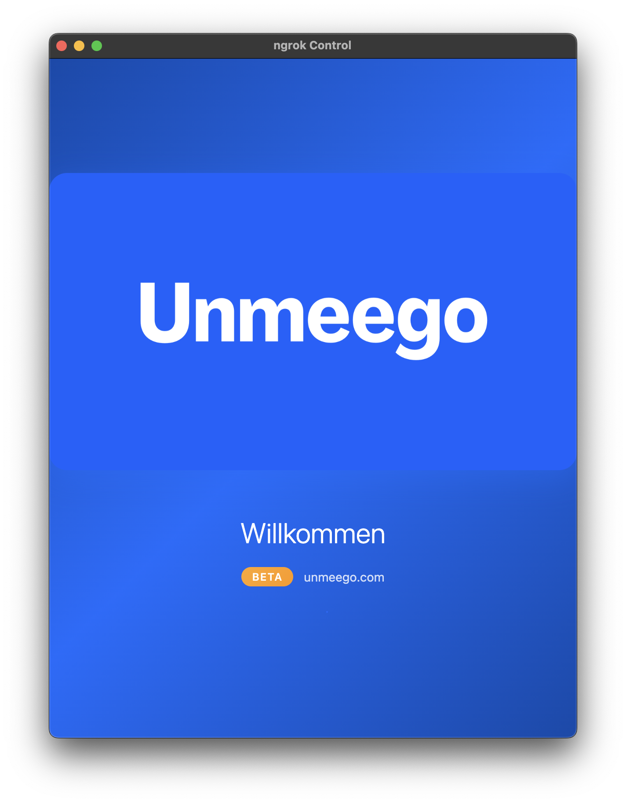
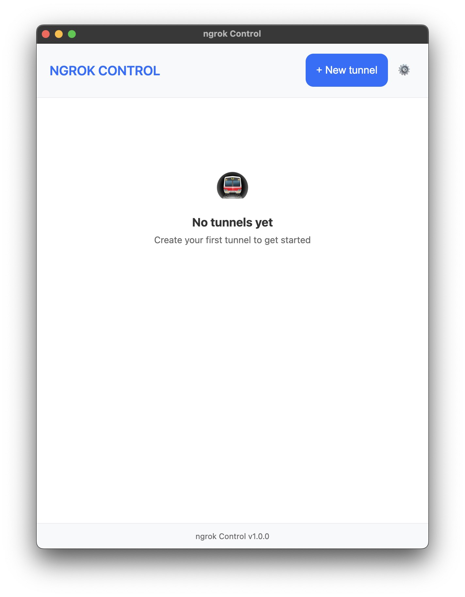
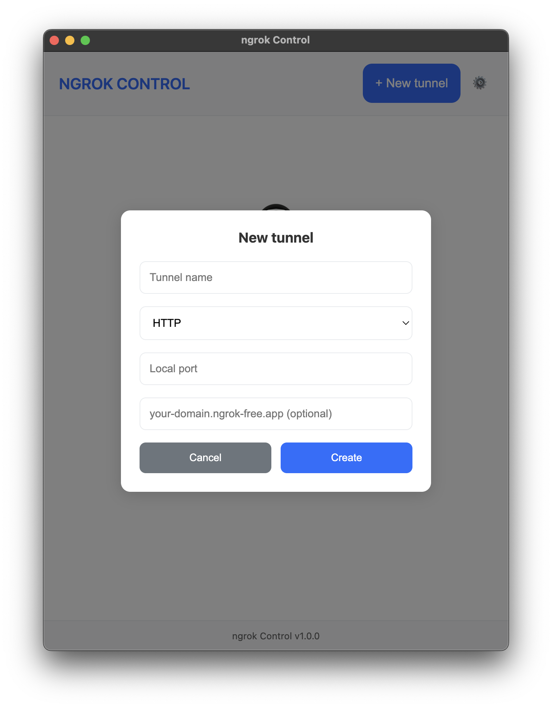
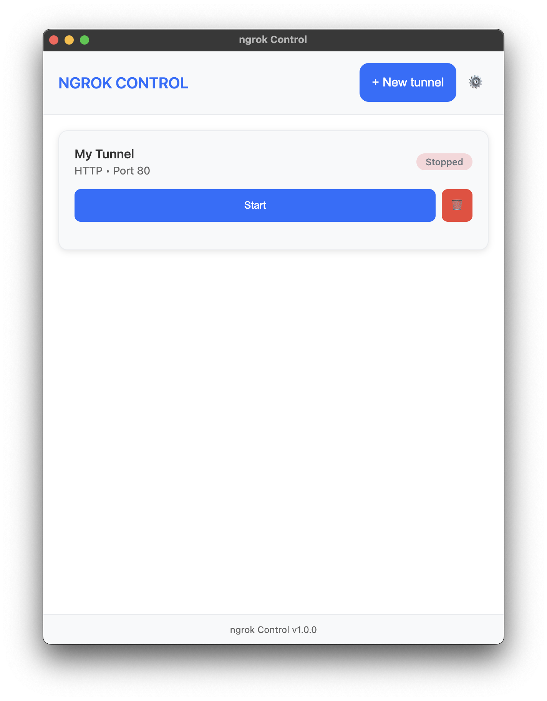
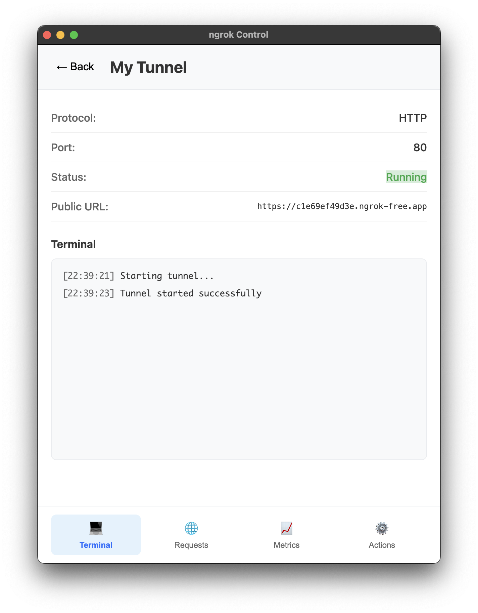
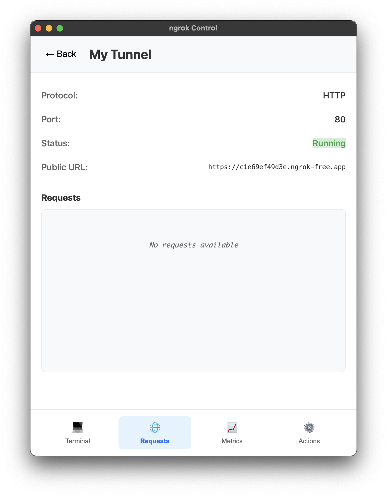
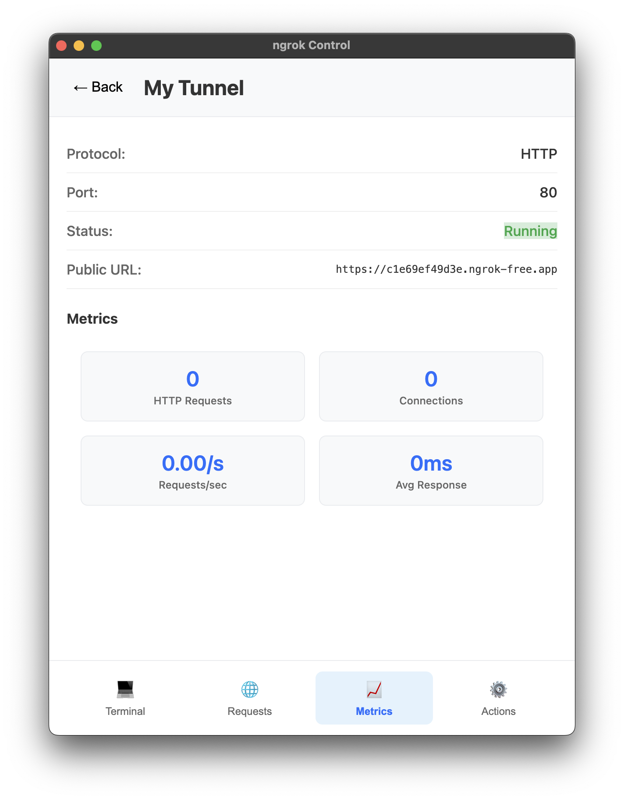
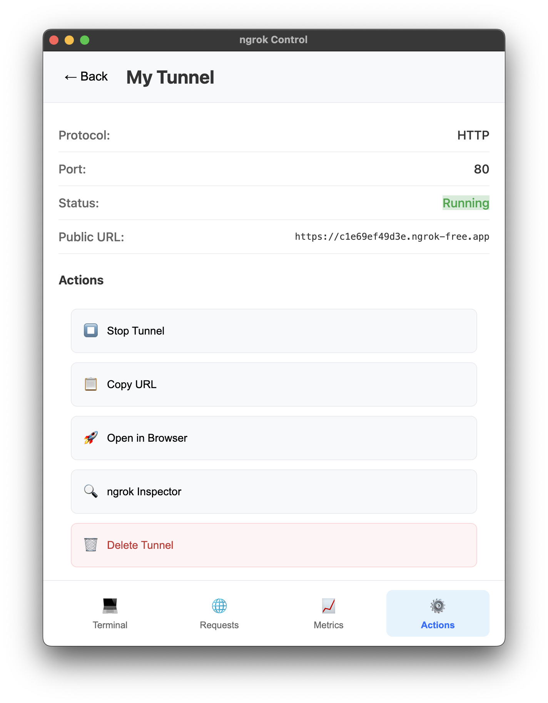
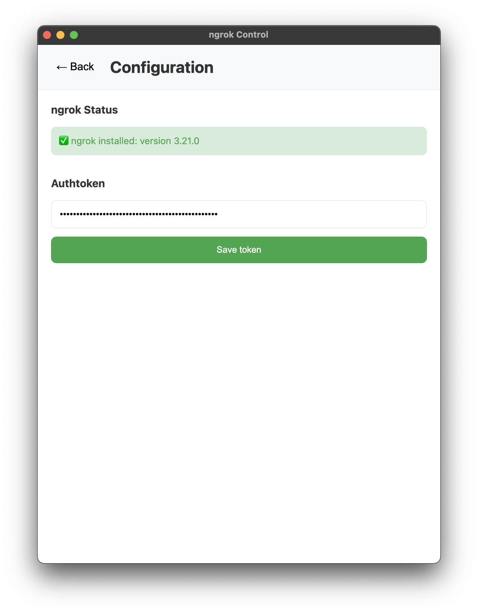

# 🚇 NGROK CONTROL

> **The most beautiful and powerful ngrok GUI ever built - Now Open Source!**

A stunning desktop application that transforms ngrok tunnel management into a delightful experience. Built with modern design principles and packed with features that developers actually need. **100% Free and Open Source.**


## 🌟 Why NGROK CONTROL is Different

### 🎨 **Beautiful Mobile-First Design**
- **Modern Interface**: Clean, intuitive design inspired by the best mobile apps
- **Smooth Animations**: Buttery smooth transitions and micro-interactions
- **Responsive Layout**: Perfect on any screen size, from laptops to ultrawide monitors
- **Dark Theme Ready**: Beautiful gradient backgrounds and modern typography

### 🚀 **Powerful Features That Actually Work**
- **🔥 Multiple Tunnels**: Run unlimited tunnels simultaneously without conflicts
- **📊 Real-time Monitoring**: Live request tracking with detailed HTTP analytics
- **🌐 Static Domains**: Full support for ngrok premium domains and custom URLs
- **⚡ One-Click Actions**: Copy URLs, open in browser, manage tunnels instantly
- **📈 Advanced Metrics**: Connection stats, response times, error rates, and more
- **🔍 Request Inspector**: Click any request to see full HTTP headers and responses
- **🎯 Smart Routing**: Automatic port detection and intelligent tunnel management

### ⚡ **Developer Experience First**
- **🚀 Zero Configuration**: Works perfectly out of the box
- **🔧 Auto-Detection**: Finds and configures ngrok automatically
- **💡 Smart Defaults**: Sensible settings for common development workflows
- **🎨 Beautiful Welcome**: Multi-language animated welcome screen
- **📱 Mobile-Style Navigation**: Intuitive tabbed interface for tunnel details

## 📸 Screenshots

### Welcome Screen

*Beautiful animated welcome with multi-language support*

### Main Dashboard

*Clean, modern dashboard with all your tunnels at a glance*

### Empty State

*Helpful empty state guides you to create your first tunnel*

### Create New Tunnel

*Simple, intuitive tunnel creation with smart defaults*

### Tunnel Details - Terminal

*Real-time terminal output with beautiful syntax highlighting*

### Tunnel Details - Requests

*Live request monitoring with detailed information*

### Request Details

*Complete HTTP request and response inspection*

### Metrics Dashboard

*Advanced analytics and performance metrics*

### Configuration Screen

*Easy configuration with automatic ngrok detection*

## 🚀 Quick Start

### 📦 Download & Install (Recommended)

#### **Ready-to-use Binaries**
- [📥 **macOS (Apple Silicon)**](https://ngrokui.unmeego.com/ngrok%20Control-1.0.0-arm64.dmg) - For M1/M2 Macs
- [📥 **macOS (Intel)**](https://ngrokui.unmeego.com/ngrok%20Control-1.0.0-x64.dmg) - For Intel Macs
- [📥 **Windows**](https://ngrokui.unmeego.com/ngrok%20Control-1.0.0-win.exe) - Windows 10/11
- [📥 **Linux**](https://ngrokui.unmeego.com/ngrok%20Control-1.0.0-linux.AppImage) - Universal Linux

### 🛠️ Build from Source

```bash
# Clone the repository
git clone https://github.com/yourusername/ngrok-control.git
cd ngrok-control

# Install dependencies
npm install

# Launch in development mode
npm start

# Build for production
npm run build
```

### 📋 Requirements
- **ngrok** installed (we'll help you install it if needed)
- **Node.js** 16+ (for building from source)
- **macOS 10.15+**, **Windows 10+**, or **Linux** with AppImage support

## 🎯 Perfect For Every Developer

### 🌐 **Web Developers**
- Test local applications with real domains
- Share development servers with clients instantly
- Debug webhooks and API integrations

### 📱 **Mobile Developers** 
- Test mobile apps against local APIs
- Share development builds with team members
- Debug push notifications and deep links

### ⚙️ **DevOps Engineers**
- Debug production integrations safely
- Test deployment pipelines locally
- Monitor API performance and errors

### 🎓 **Students & Learners**
- Learn web development with real domains
- Share projects with friends and mentors
- Practice API development and testing

### 👥 **Teams & Agencies**
- Collaborate on development projects
- Demo features to clients instantly
- Share development environments securely

## 🔥 Why Choose NGROK CONTROL?

| Feature | 🚇 NGROK CONTROL | 🔧 Command Line | 🖥️ Other GUIs |
|---------|------------------|-----------------|----------------|
| **Beautiful Interface** | ✅ Modern mobile-style UI | ❌ Terminal only | ⚠️ Outdated designs |
| **Real-time Requests** | ✅ Live monitoring + details | ❌ Basic text logs | ❌ Limited logging |
| **Multiple Tunnels** | ✅ Unlimited simultaneous | ⚠️ Complex commands | ⚠️ Often limited |
| **Static Domains** | ✅ Full premium support | ✅ Command line only | ❌ Not supported |
| **Request Inspector** | ✅ Full HTTP details | ❌ Raw logs only | ❌ Basic info |
| **Metrics Dashboard** | ✅ Advanced analytics | ❌ No metrics | ❌ Basic stats |
| **Easy Setup** | ✅ One-click install | ❌ Manual config | ⚠️ Complex setup |
| **Cross-Platform** | ✅ Mac, Windows, Linux | ✅ All platforms | ⚠️ Limited support |
| **Open Source** | ✅ MIT License | ✅ Open source | ❌ Often proprietary |

## 🛠️ Built With Modern Technology

- **⚡ Electron** - Cross-platform desktop framework for native performance
- **🎨 Modern CSS3** - Beautiful animations, gradients, and responsive design  
- **🚀 ES6+ JavaScript** - Clean, maintainable code architecture
- **🔌 ngrok API** - Deep integration with ngrok's powerful features
- **💾 Electron Store** - Secure, encrypted settings storage
- **📊 Real-time Updates** - Live monitoring without performance impact

## 🌟 Open Source & Community Driven

### 🤝 **Why Open Source?**
- **🔍 Transparency**: See exactly how your data is handled
- **🛡️ Security**: Community-audited code you can trust
- **🚀 Innovation**: Contribute features you need
- **📚 Learning**: Study modern Electron app architecture
- **🌍 Community**: Join developers worldwide improving the tool

### 🎯 **How to Contribute**
- ⭐ **Star this repo** - Show your support!
- 🐛 **Report bugs** - Help us improve quality
- 💡 **Request features** - Tell us what you need
- 🔧 **Submit PRs** - Code contributions welcome
- 📖 **Improve docs** - Help others get started
- 💬 **Join discussions** - Share ideas and feedback

### 🏆 **Contributors Welcome**
We're looking for contributors to help with:
- 🎨 **UI/UX improvements** - Make it even more beautiful
- 🔧 **New features** - Add functionality developers need
- 🌍 **Translations** - Support more languages
- 📱 **Mobile companion** - Extend to mobile platforms
- 🔌 **Integrations** - Connect with other dev tools
- 📚 **Documentation** - Help others learn and contribute

## 🚀 Roadmap & Future Plans

### 🎯 **Coming Soon**
- [ ] **🌙 Dark Mode** - Full dark theme support
- [ ] **🔌 Plugin System** - Extend functionality with plugins
- [ ] **☁️ Cloud Sync** - Sync settings across devices
- [ ] **👥 Team Features** - Share tunnels with your team
- [ ] **📱 Mobile App** - Companion mobile application
- [ ] **🐳 Docker Support** - Containerized deployments
- [ ] **🔔 Notifications** - Desktop notifications for events
- [ ] **📊 Advanced Analytics** - More detailed metrics and insights

### 🌟 **Long-term Vision**
- **🌍 Multi-language Support** - Interface in 10+ languages
- **🤖 AI-Powered Insights** - Smart suggestions and optimizations
- **🔗 Integration Hub** - Connect with popular dev tools
- **📈 Performance Monitoring** - Advanced APM features
- **🛡️ Security Scanner** - Built-in security analysis

## 💝 Support the Project

### 🌟 **Free Ways to Help**
- ⭐ **Star the repository** - It really helps with visibility!
- 🐦 **Share on social media** - Spread the word to other developers
- 📝 **Write a blog post** - Share your experience using the app
- 🎥 **Create tutorials** - Help others learn to use it effectively
- 💬 **Join our community** - Participate in discussions and help others

### 🎯 **For Organizations**
- 📢 **Sponsor development** - Help us work on this full-time
- 🏢 **Enterprise features** - Custom features for your team
- 🎓 **Training & Support** - Professional support and training
- 🤝 **Partnership opportunities** - Integrate with your products

## 📄 License & Legal

**MIT License** - This project is completely free and open source. You can:
- ✅ Use it commercially
- ✅ Modify the source code  
- ✅ Distribute copies
- ✅ Include in proprietary software
- ✅ Sell copies or services

**No warranty** - Provided "as is" without warranty of any kind.

## 🚀 Ready to Transform Your Development Workflow?

### **[⬇️ Download Now](https://ngrokui.unmeego.com/ngrok%20Control-1.0.0-arm64.dmg)** 

**Join thousands of developers** who have already transformed their ngrok workflow with the most beautiful GUI ever built.

---

<div align="center">

### 🌟 **Made with ❤️ by the Developer Community**

**[⭐ Star this repo](https://github.com/yourusername/ngrok-control)** • **[🐛 Report Issues](https://github.com/yourusername/ngrok-control/issues)** • **[💡 Request Features](https://github.com/yourusername/ngrok-control/discussions)**

*Transform your ngrok experience today - it's free, it's open source, and it's beautiful.*

</div>